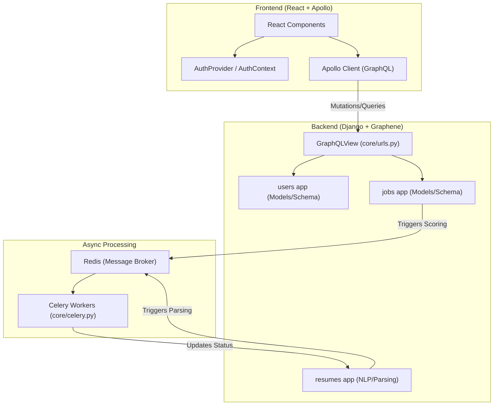
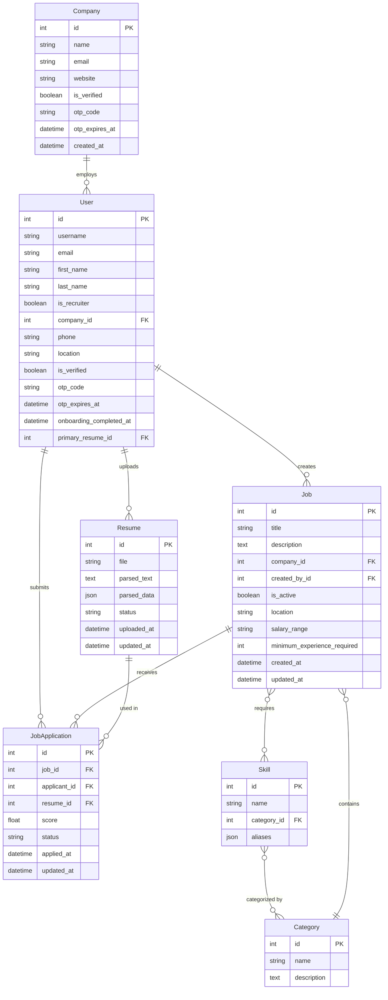
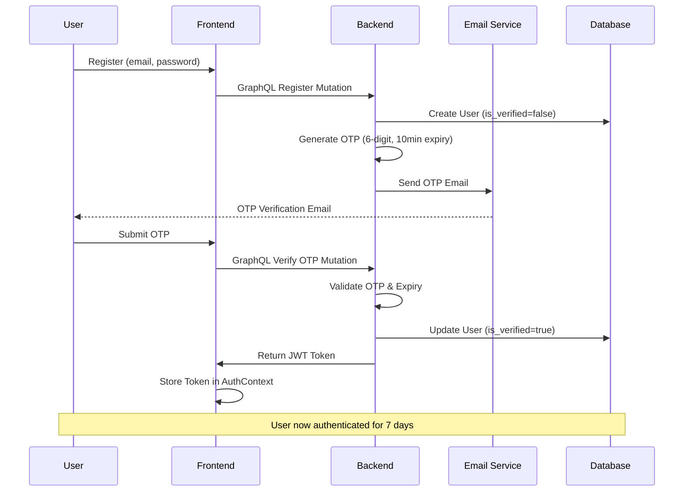
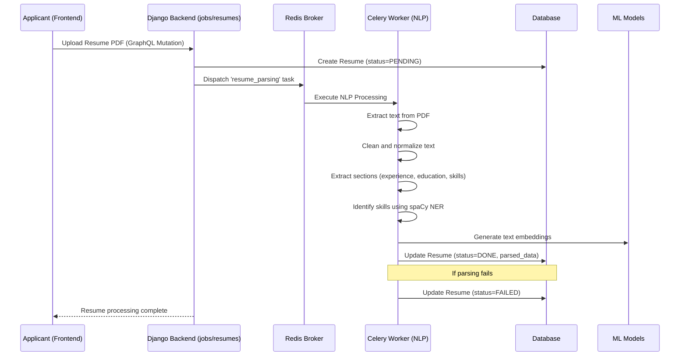
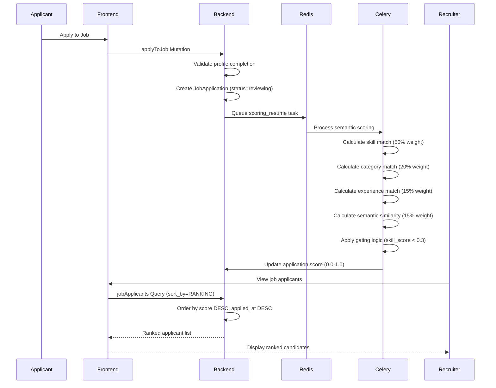
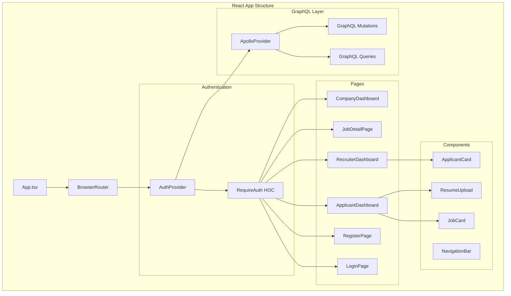
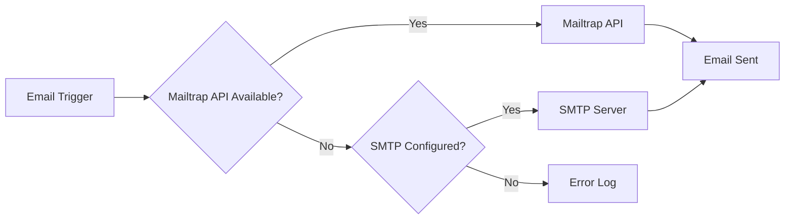
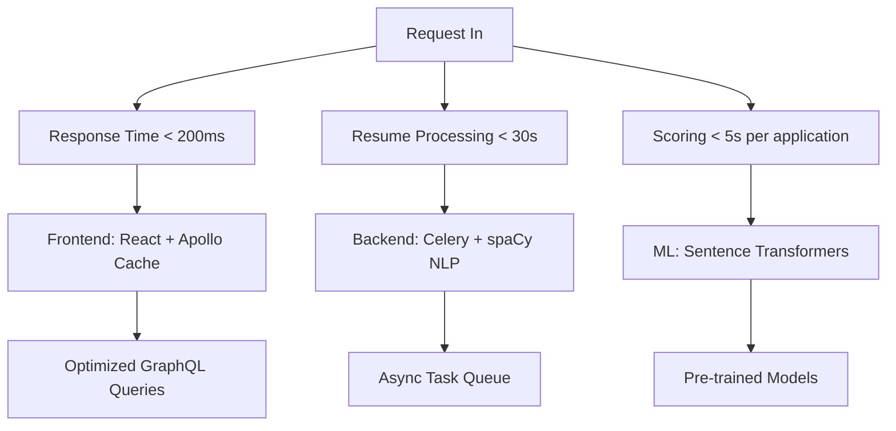

[](https://deepwiki.com/Tanish0023/smart-recruitment)

# Smart Recruitment System

A modern, AI-powered recruitment platform that streamlines hiring through automated resume parsing, semantic scoring, and intelligent candidate matching.

## 🚀 Features

- **Dual-Role System**: Separate workflows for applicants and recruiters with role-based authentication
- **AI-Powered Resume Processing**: Automatic parsing and skill extraction using NLP (spaCy)
- **Semantic Job Matching**: Intelligent scoring based on similarity between resumes and job descriptions
- **Real-time Notifications**: Email service for OTP verification and application status updates
- **Modern UI**: React frontend with TypeScript and Tailwind CSS
- **GraphQL API**: Efficient data querying with Apollo Client
- **Background Processing**: Celery workers for heavy tasks like resume parsing and scoring
- **Docker Support**: Containerized development environment

## 🏗️ Architecture

### High Level Diagram


### System Overview

The system follows a decoupled architecture with clear separation between frontend, backend, and async processing layers:



### Database Schema



### Core Components

#### User Management (`users` app)

- **User Model**: Extends `AbstractUser` with role flags and profile completion logic [1](#1-0)
- **Company Model**: Organization entity with OTP verification [2](#1-1)
- **Authentication**: JWT-based with OTP verification for both users and companies

#### Job Management (`jobs` app)

- **Job Model**: Postings with skills, categories, and experience requirements [3](#1-2)
- **JobApplication Model**: Junction model storing match scores and application status [4](#1-3)
- **Skills & Categories**: Hierarchical tagging system for better matching

#### Resume Processing (`resumes` app)

- **Resume Model**: Tracks file processing status (PENDING, PROCESSING, DONE, FAILED) [5](#1-4)
- **NLP Pipeline**: Uses spaCy for text extraction and skill identification
- **Scoring Algorithm**: Semantic similarity calculation using sentence-transformers

## 🛠️ Technology Stack

| Layer          | Technologies                                      | Key Components                                        |
| -------------- | ------------------------------------------------- | ----------------------------------------------------- |
| **Frontend**   | React, TypeScript, Tailwind CSS, Apollo Client    | `AuthProvider`, `RequireAuth`, `apollo-upload-client` |
| **Backend**    | Django, Graphene (GraphQL), Django REST Framework | `core.settings`, `GraphQLView`, `JWT`                 |
| **Database**   | PostgreSQL, Redis (Broker/Cache)                  | `psycopg2-binary`, `django-redis`                     |
| **Task Queue** | Celery, Flower (Monitoring)                       | `celery_worker`, `celery_email`, `resume_parsing`     |
| **NLP/AI**     | Spacy, Sentence-Transformers, PyPDF2              | `resume_parsing` task, `scoring_resume` task          |

## 📁 Project Structure

```
smart-recruitment/
├── backend/              # Django application
│   ├── core/            # Core Django settings and URLs
│   ├── users/           # User authentication and profiles
│   ├── jobs/            # Job postings and applications
│   ├── resumes/         # Resume processing and NLP
│   ├── email_service/   # Email notifications
│   └── requirements.txt
├── frontend/            # React application
│   ├── src/
│   │   ├── pages/       # Page components
│   │   ├── contexts/    # React contexts
│   │   ├── components/  # Reusable UI components
│   │   └── graphql/     # GraphQL queries/mutations
│   └── package.json
├── docker-compose.yml
├── Dockerfile
└── .github/workflows/   # CI/CD pipelines
```

## 🔄 How It Works

### Application Flow

1. **Job Posting**: Recruiters create jobs with specific skills and requirements
2. **Candidate Application**: Applicants submit resumes or apply to jobs
3. **AI Processing**: System automatically parses resumes and extracts skills
4. **Scoring**: Calculates semantic similarity between resume and job description
5. **Ranking**: Presents recruiters with a ranked list of candidates
6. **Communication**: Sends automated email notifications for status updates

### Detailed Authentication Flow



### Resume Processing Pipeline



### Job Application & Scoring Flow



### Frontend Component Architecture



## 🚀 Quick Start

### Using Docker (Recommended)

```bash
# Start all services
docker compose up --build

# Services will be available at:
# - Django Backend: http://localhost:8000
# - GraphQL: http://localhost:8000/graphql/
# - Flower (Celery): http://localhost:5555
# - PostgreSQL: localhost:6400
# - Redis: localhost:3400
```

### Local Development

#### Backend Setup

```bash
cd backend
python -m venv venv
source venv/bin/activate  # On Windows: venv\Scripts\activate
pip install -r requirements.txt
python manage.py migrate
python manage.py runserver
```

#### Frontend Setup

```bash
cd frontend
npm install
npm run dev
```

## ⚙️ Configuration

### Backend Environment Variables

Create `.env` in backend:

```
DEBUG=True
SECRET_KEY=your-secret-key
DATABASE_URL=postgresql://postgres:postgres@db:5432/recruitment_db
REDIS_URL=redis://redis:6379/0
MAILTRAP_API_TOKEN=your-mailtrap-token
DEFAULT_FROM_EMAIL=noreply@yourcompany.com
GOOGLE_OAUTH_CLIENT_IDS=your-google-web-client-id.apps.googleusercontent.com
```

### Frontend Environment Variables

Create `.env.local` in frontend:

```
VITE_GRAPHQL_URL=http://localhost:8000/graphql/
VITE_API_URL=http://localhost:8000/api/
VITE_GOOGLE_CLIENT_ID=your-google-web-client-id.apps.googleusercontent.com
```

## 🔑 Key Features Implementation

### Profile Completion Algorithm

Calculated as: 40% (Basic Info) + 40% (Skills) + 20% (Resume) [6](#1-5)

```python
def profile_completion_percent(self):
    status = self.profile_sections_status()
    weight = {
        "basicInfo": 40,    # Name, phone, location
        "skills": 40,       # At least one skill
        "resume": 20,       # Uploaded and parsed resume
    }
    return sum(points for section, points in weight.items() if status.get(section))
```

### Email Service Architecture

Uses Mailtrap API with SMTP fallback for transactional emails [7](#1-6)



### Resume Scoring Algorithm

Applications are scored between 0.0 and 1.0 based on multiple factors [8](#1-7)

```python
def calculate_final_score(skill, category, experience, semantic):
    return (
        0.5 * skill +        # MOST IMPORTANT - skill matching
        0.2 * category +     # category alignment
        0.15 * experience +  # experience requirements
        0.15 * semantic      # cosine similarity
    )
```

### GraphQL API Schema

#### Authentication Mutations

```graphql
mutation {
  register(username: String!, email: String!, password: String!)
  verifyUserOtp(otp: String!)
  applicantLogin(username: String!, password: String!)
  companyLogin(username: String!, password: String!)
    googleApplicantAuth(idToken: String!)
    googleCompanyAuth(idToken: String!, companyName: String, companyWebsite: String)
}
```

#### Job Management

```graphql
query {
  allJobs {
    id, title, description, company, location, salaryRange
  }
  jobDetail(jobId: Int!) {
    id, title, description, skills, categories
  }
}

mutation {
  createJob(title: String!, description: String!, skills: [Int!])
  applyToJob(jobId: Int!)
  updateApplicationStatus(applicationId: Int!, status: String!)
}
```

## 🧪 Development Guidelines

### Code Quality

```bash
# Backend: Flake8
cd backend
flake8 .

# Frontend: ESLint
cd frontend
npm run lint
```

### Testing

```bash
# Backend
cd backend
python manage.py test

# Frontend
cd frontend
npm run build
```

## 📊 Monitoring & Performance

### System Monitoring

- **Flower**: Celery task monitoring at http://localhost:5555
- **GraphQL Playground**: Interactive API testing at http://localhost:8000/graphql/
- **Database**: PostgreSQL with connection pooling
- **Redis**: Message broker and caching layer

### Performance Metrics



## 🔐 Security Features

- **OTP Verification**: Two-factor authentication for email verification
- **JWT Authentication**: Secure token-based authentication with 7-day expiration<cite repo="Tan
